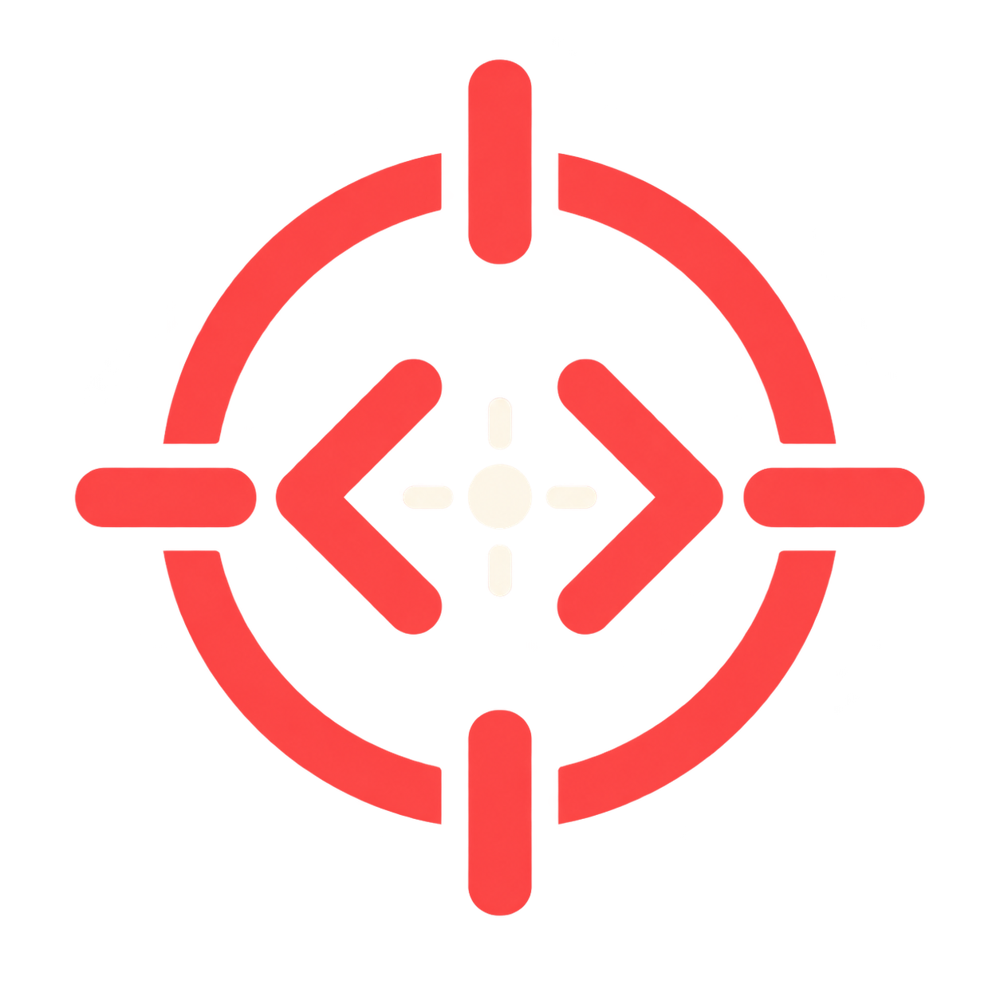
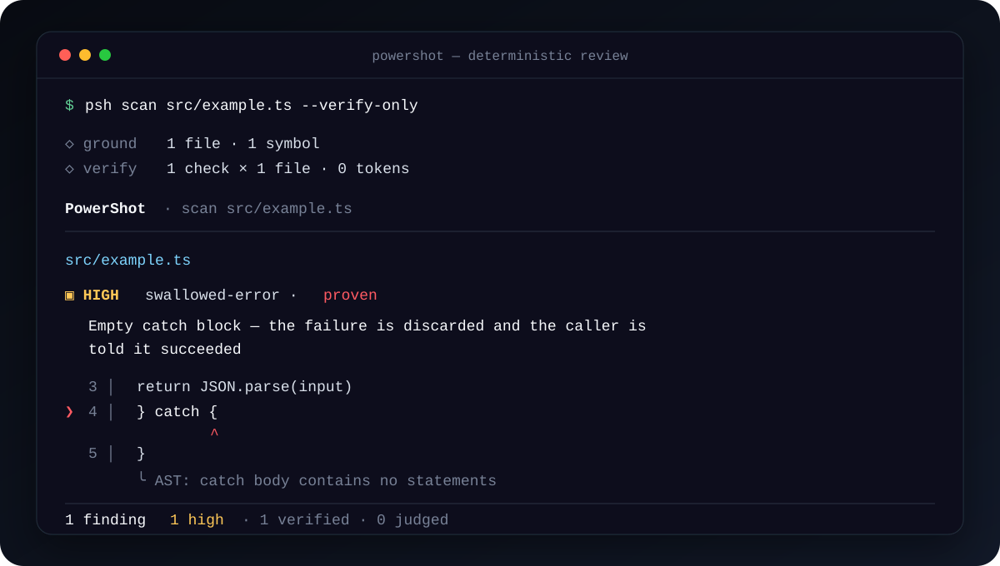
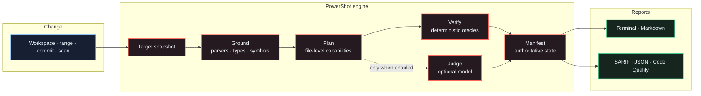
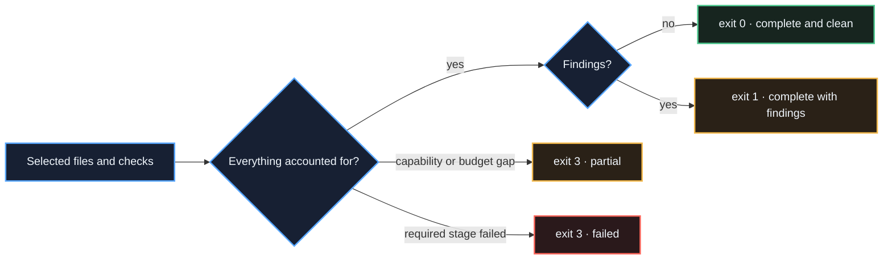

<p align="center">
  
</p>

<h1 align="center">PowerShot</h1>

<p align="center">
  <strong>Oracle-first code review for machine-written code.</strong><br>
  Verify with code. Judge with the model.
</p>

<p align="center">
  <a href="https://github.com/xcrft/powershot/actions/workflows/ci.yml"></a>
  <a href="https://www.npmjs.com/package/@0xcraft/powershot"></a>
  
  <a href="LICENSE"></a>
</p>

PowerShot reviews the failure modes that plausible-looking generated code tends to
hide: invented APIs, undeclared dependencies, dropped guards, swallowed errors,
tests that prove nothing, bent expectations, stale callers, and duplicated helpers.

It asks compilers, parsers, manifests, reference graphs, and pre/post ASTs first.
Optional model judges only handle questions that still require judgement.

<table>
  <tr>
    <td width="33%"><strong>Deterministic first</strong><br>Local checks need no model, key, tokens, or network calls.</td>
    <td width="33%"><strong>Honest completion</strong><br>A partial run cannot present itself as a clean verdict.</td>
    <td width="33%"><strong>CI-native output</strong><br>One run emits terminal, Markdown, JSON, SARIF, manifest, and Code Quality reports.</td>
  </tr>
</table>

## See it in action

This is real output from a deterministic scan of an empty `catch` block:



## Quick start

PowerShot requires Node.js 24 or newer.

```bash
npm install --global @0xcraft/powershot
psh review --verify-only
```

The package also installs the longer `powershot` command:

```bash
powershot scan src/ --verify-only
```

## How a review moves



1. **Snapshot** resolves the exact tree the review is about.
2. **Ground** builds the available type, syntax, dependency, and reference oracles.
3. **Plan** assigns checks and missing capabilities to each file individually.
4. **Verify** runs deterministic checks and records what actually executed.
5. **Judge** optionally reviews bounded bundles of related files.
6. **Manifest** decides whether the result is complete, partial, or failed.
7. **Report** renders the same result for people and CI consumers.

Read the full [architecture guide](docs/architecture.md) for module boundaries,
runtime sequence, invariants, and extension paths.

## Findings you can calibrate

Every finding says where it came from:

| Class | Confidence | Meaning |
|---|---|---|
| `verified` | `proven` | An oracle answered the exact question |
| `verified` | `firm` | A deterministic heuristic fired; inspect the evidence |
| `judged` | `firm` or `tentative` | A model supplied the judgement and provenance |

PowerShot stays silent when a required oracle is unavailable. The missing capability
is written to the manifest instead of being counted as a pass.

## Deterministic checks

| Check | Detects | Evidence |
|---|---|---|
| `phantom-api` | Missing members, invalid calls, incompatible APIs | Type checker |
| `phantom-dep` | Imports absent from project manifests | Dependency manifests |
| `phantom-config` | Configuration keys with no declared source | Repository config index |
| `contract-drift` | Signature changes with callers left behind | Types and references |
| `reinvented` | New helpers duplicating existing symbols | Symbol index |
| `dropped-guard` | Removed guards, early returns, protective branches | Pre/post AST |
| `swallowed-error` | Empty or ineffective error handling | AST shape |
| `vacuous-test` | Tests that do not assert behavior | Test AST |
| `assertion-drift` | Expectations changed under stable behavior | Pre/post test AST |
| `copy-paste-drift` | Clones with an inconsistent rename | Token and AST comparison |
| `dead-on-arrival` | Added code with no reachable reference | Reference graph |
| `scope-creep` | Files touched without a program-level change | Token comparison |
| `lying-comment` | Documentation contradicted by a signature | Signature and comment parser |

## CLI

```bash
# Staged, unstaged, and untracked work
psh review --verify-only

# Branch range or single commit
psh review --verify-only --from main --to HEAD
psh review --verify-only --commit <sha>

# Existing files without Git history
psh scan src/

# Select checks and severity
psh review --verify-only --checks phantom-api,swallowed-error
psh review --verify-only --min-severity high

# Create several artifacts from one verdict
psh review --verify-only \
  --report sarif=out/powershot.sarif \
  --report markdown=out/powershot.md \
  --report json=out/powershot.json
```

Useful options:

| Option | Purpose |
|---|---|
| `--verify-only` | Run deterministic checks only |
| `--checks a,b` | Run only named checks |
| `--min-severity <level>` | Filter below `info`, `low`, `medium`, `high`, or `critical` |
| `--format <format>` | Select the primary output format |
| `--report <format>=<path>` | Add an output artifact; repeat as needed |
| `--max-bundle <lines>` | Bound each optional judge unit |
| `--budget k=v,...` | Bound requests, tokens, tools, elapsed time, or units |
| `--resume <id>` | Continue a compatible saved session |
| `--no-cache` | Ignore cached judge answers |

Run `psh --help` for sessions, dismissals, delegation, agent setup, and benchmark
commands.

## Completion is a contract



| Exit | Contract |
|---:|---|
| `0` | Review completed and found nothing at the selected severity |
| `1` | Review completed and reported findings |
| `2` | Command or Git input was invalid |
| `3` | Review is incomplete; findings may be missing |

“No findings” and “PowerShot could not look” are intentionally different pipeline
outcomes. Use `--format manifest` to inspect file dispositions, executed checks,
skips, failures, judge units, and `notLookedAt`.

## CI integration

The composite action is the shortest setup for GitHub:

```yaml
- uses: actions/checkout@v7
  with:
    fetch-depth: 0

- uses: xcrft/powershot@v1
  with:
    verify-only: 'true'
    comment: 'true'
    fail-on-findings: 'true'
```

`@v1` follows compatible `1.x` releases. Pin the action to a full commit SHA in a
protected required workflow when immutable dependencies are required.

The [CI guide](docs/ci.md) covers exit handling, Git history, one-run/many-report
artifacts, GitLab Code Quality, local parity, and recommended gate policies.

Copy-paste examples:

- [GitHub composite Action](examples/github-actions/action.yml)
- [GitHub direct CLI workflow](examples/github-actions/cli.yml)
- [GitLab Code Quality job](examples/gitlab/.gitlab-ci.yml)

## Optional model judges

Judges cover plausible logic, test adequacy, change intent, and repository conventions.
Anthropic, OpenAI, and Gemini providers are supported.

```json
{
  "provider": "anthropic",
  "model": "claude-sonnet-5",
  "verifiers": { "enable": ["*"] },
  "judges": {
    "enable": ["plausible-logic", "test-adequacy", "intent"]
  },
  "minSeverity": "low",
  "ignore": ["**/generated/**"],
  "promptCache": true
}
```

Save this as `powershot.config.json`, set the provider key in the surrounding
environment, and omit `--verify-only`:

```bash
export ANTHROPIC_API_KEY=...
psh review --from main --to HEAD
```

If your coding agent already has a model, delegate the judgement instead of paying for
another call:

```bash
psh delegate > /tmp/powershot-brief.md
# Follow the brief and write its JSON array to /tmp/powershot-findings.json
psh review --verify-only --absorb /tmp/powershot-findings.json
```

## Language coverage

| Language | Available oracles |
|---|---|
| TypeScript, JavaScript | Compiler types, references, manifests, syntax, pre/post AST |
| Python | Tree-sitter syntax and dependencies; optional `pyright` adds semantic checks |
| Ruby | Tree-sitter syntax and dependency manifests |
| Go, Java, C#, C++, PHP, Kotlin, Rust | Declared syntax-backed checks |
| C | Syntax-backed checks that do not require exception semantics |
| Solidity | Declared syntax-backed checks |

PowerShot loads a bounded number of grammars per run. Unsupported or unavailable
coverage is named in the manifest.

## Project guide

| Document | Use it for |
|---|---|
| [Architecture](docs/architecture.md) | Module boundaries, runtime sequence, invariants, extensions |
| [CI integration](docs/ci.md) | Gate policy, GitHub, GitLab, artifacts, exit handling |
| [Contributing](CONTRIBUTING.md) | Setup, change placement, verification, pull requests |
| [Security policy](SECURITY.md) | Reporting a vulnerability |

## Development

```bash
npm ci
npm test
node dist/cli.js review --verify-only
```

`npm test` builds the project, runs the core self-check suite, and validates every
enabled language pack. `npm run smoke` packs the project, installs the tarball into a
clean repository, and exercises the public binary.

## License

PowerShot is available under the [Apache License 2.0](LICENSE).
