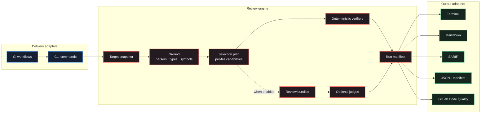
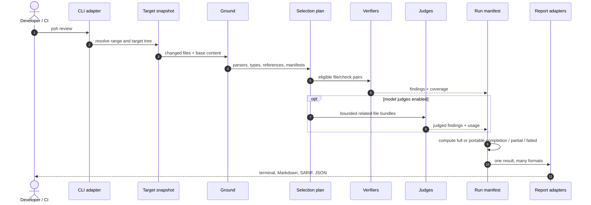

# Architecture

PowerShot is a single-package review engine with a small CLI adapter. The package is
split by runtime responsibility, not by hypothetical deployment boundaries: no module
below is independently versioned or consumed.

## System shape

The dependency direction is inward. Delivery and report adapters depend on the review
engine. The engine does not depend on a workflow provider or terminal layout.

## Module boundaries

| Module | Owns | Does not own |
|---|---|---|
| `src/cli/` | Argument parsing, command dispatch, report publication, exit mapping | Review algorithms |
| `src/review.ts` | One review run and its stage orchestration | CLI parsing or presentation |
| `src/ground.ts` | Change-scoped TypeScript projects, parse trees, manifests, base-aware implementation index | Check selection |
| `src/plan.ts` | File selection and per-file capability accounting | Finding generation |
| `src/manifest.ts` | Completion state and the authoritative run record | Rendering |
| `src/verifiers/` | Deterministic check implementations | Model calls |
| `src/judges/` | Prompt data, bounded model loop, tool adapter | Git target selection |
| `src/lang/` | Language-pack data, isolated parser workers, optional language oracles | Cross-run policy |
| `src/report/` | Pure output adapters | Re-running or reinterpreting a review |
| `src/github/` | GitHub REST transport and pull-request publication reconciliation | Review decisions or report rendering |
| `src/bench.ts` | Historical and labelled evaluation | Production command dispatch |
| `src/session.ts`, `src/cache.ts` | Reuse of completed judge work | Completion decisions |

`src/cli.ts` contains only the executable boundary. It delegates to `src/cli/app.ts`,
which routes a command to a deeper module. This keeps a new output format or maintenance
command from increasing the dependency fan-out of the executable.

### Import discipline

Use `./` while the dependency is reachable without leaving the current directory. Use
`#app/*.js` instead of `../` traversal. The alias is a native Node.js package import
mapped to `dist`, so TypeScript, the built CLI, and the installed npm package share one
resolution rule. Keep `node:*` for the standard library and package names for external
dependencies. The self-test checks every TypeScript source recursively and rejects
static, side-effect, dynamic, and CommonJS parent imports.

## Runtime sequence

## Load-bearing invariants

### One target tree

A branch or commit review reads source from the target revision, not from whatever is
currently present in the working directory. Grounding, verification, bundling, and
positioning all receive the same tree.

### Capabilities belong to files

A run can contain a typed TypeScript file beside a Python file or a TypeScript file
excluded from `tsconfig`. Capabilities therefore live on each selected file. A checker
available somewhere in the run is not evidence that it inspected every file.

The policy decides what an absent capability means. Under default `portable` coverage,
self-contained syntax and manifest oracles remain a complete verdict while unavailable
`types`, `references`, and `python-types` are recorded as optional depth. Under
`strict` coverage, or when a check is named explicitly, the same gap is required and
makes the review partial.

### Monorepo grounding follows the change

For each changed TypeScript or JavaScript file, grounding inspects only its ancestor
directories for `tsconfig.json` and `tsconfig.*.json`. The nearest config that owns
the file wins. Empty solution configs yield to their leaf configs, and an excluded
test can reuse the closest non-empty leaf project when its type environment resolves.
Projects and directory listings are cached across files, then their source closures
are deduplicated for syntax searches and symbol indexing.

There is deliberately no repository-wide fallback glob. When no relevant config
exists, only changed files are parsed and type-dependent capabilities remain absent.
That keeps a configless or mixed-language monorepo proportional to the review rather
than to the repository.

Python dependency grounding follows the same rule. Local modules are discovered from
direct entries on each changed file's ancestor chain and conventional `src`, `lib`, or
`python` roots. It never recursively crawls an unrelated monorepo tree.

### Proven findings have one proof shape

A syntax oracle abstains when a refactor falls outside the exact fact it can prove.
`dropped-guard` pairs stable module bindings, owner, bodyless callable contract, and
structural block path. It then removes only the candidate guard nodes from the old file
and requires every remaining compiler-visible token to equal the new file. Any other
executable change in a supported source file also makes the check abstain, because the
guard may have moved across that boundary. An import, type, ancestor condition, sibling
statement, helper extraction, or moved continuation therefore cannot become a
HIGH/proven defect. The check also abstains when the same token-normalized guard remains
elsewhere in the callable. The changed-source index is built once from the complete diff
inventory, including renamed, deleted, and policy-waived paths, so the proof stays linear
in a large monorepo instead of rescanning the change for every callable.

`reinvented` follows only language-declared module wrappers, includes decorators and
templates in the token fingerprint, and keeps package and namespace identity separate.
Its syntax evidence does not claim semantic accessibility: it requires matching declared
visibility, wrappers, imports, referenced module bindings, conditional compilation, and
relative binding directory before calling a declaration plausibly reusable.
Go also requires the same source directory because its import path, not its package
clause alone, defines cross-file reuse. Anonymous namespaces and file-private
declarations are excluded. Type bodies, receiver implementations, and nested test
support are not treated as interchangeable module-level alternatives. Ambiguous
identities stay available to the optional judge instead of becoming verified facts.

### Grammar memory is isolated by language

Tree-sitter WASM compilation outlives its JavaScript parser objects. Keeping every
declared grammar in one process pushed measured RSS past 690MB. Production parsing
therefore groups changed files by language, sends at most 128 files or 8MB of source to
one disposable worker, hydrates plain AST data in the parent, and terminates the worker.
Compiled-grammar memory is bounded by one language batch rather than by the
repository's language count; hydrated AST data remains proportional to the selected
diff, not the whole repository. A parser failure for a declared language fails
selection instead of quietly waiving the file.

### The manifest owns completion

Findings alone cannot distinguish a clean review from an interrupted or unsupported
one. `RunManifest` accounts for selected files, executed and unavailable checks, judge
units, failures, limits, and skips. `state` answers whether required work completed;
`coverage` separately says `full` or `portable`. Renderers and the CLI consume that
record instead of deriving their own verdict.

```mermaid
stateDiagram-v2
    [*] --> Selected
    Selected --> Full: every file, unit, and enriched oracle accounted for
    Selected --> Portable: required work complete; enriched gaps named
    Selected --> Partial: required oracle, budget, or cancellation gap
    Selected --> Failed: required stage or file failed
    Full --> Exit0: no findings
    Full --> Exit1: findings
    Portable --> Exit0: no findings
    Portable --> Exit1: findings
    Partial --> Exit3
    Failed --> Exit3
```

### One run, many reports

`--report` fans one review result into multiple adapters. CI should never execute the
review once for SARIF and again for Markdown: optional judges can answer differently,
and duplicated runs waste both time and tokens.

## Extension paths

### Add a deterministic verifier

1. Implement the `Verifier` contract in `src/verifiers/`.
2. Declare its domain and required capabilities.
3. Export one unique id from `src/verifiers/index.ts`.
4. Add positive and negative cases to the self-check suite.
5. Document the check in the README only after the oracle is exercised by tests.

### Add a language pack

Add grammar data and conventions in `src/lang/packs.ts`, then add a dedicated fixture
to `src/langtest.ts` and include it in the all-languages review regression. Development
fixtures and production parsing both isolate grammars by process, so no supported pack
shares one unbounded WASM heap with the rest.

### Add a report format

Implement a pure function in `src/report/`, register it in `src/cli/reports.ts`, and
test its consumer contract. A renderer receives findings and the manifest; it does not
call the review engine.

### Add a CLI command

Place command behavior under `src/cli/` and add one dispatch line to `app.ts`. If the
command needs review results, use the existing review command interface rather than
importing individual verifiers into the executable.

## Verification strategy

- `npm run build` checks module contracts with strict TypeScript.
- `npm test` runs core self-checks and every enabled language pack.
- `npm run smoke` packs, installs, and exercises the public binary in a clean project.
- `node dist/cli.js review --verify-only` reviews the working diff through PowerShot's
  own deterministic pipeline.

See [CI integration](ci.md) for the delivery contract and
[CONTRIBUTING.md](../CONTRIBUTING.md) for the change workflow.
